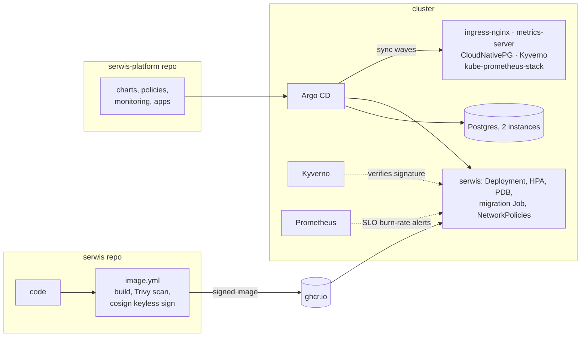

# serwis-platform

[](https://github.com/faceitall123qwe-hub/serwis-platform/actions/workflows/e2e.yml)

Runs [serwis](https://github.com/faceitall123qwe-hub/serwis) (a Next.js + Postgres app) on
Kubernetes the way I'd want a small production setup to look: everything in git, deployed by
Argo CD, a replicated Postgres managed by an operator, only signed images allowed to run, and
alerts based on an SLO rather than CPU graphs.

On every push, CI creates a fresh 3-node cluster, installs the whole platform from scratch
through Argo CD at that exact commit, and runs end-to-end and policy tests against it.



## What's in it

| Path | |
|---|---|
| `bootstrap/` | Installs Argo CD with Helm and hands over to it. The only imperative step. |
| `apps/` | App of apps: every component is an Argo CD `Application`, ordered with sync waves (operators, then policies and monitoring, then the app) |
| `charts/serwis/` | Helm chart for the app: Deployment, Service, Ingress, HPA, PDB, NetworkPolicies, a CloudNativePG `Cluster` and a migration Job |
| `policies/` | Kyverno policies |
| `monitoring/` | SLO recording rules and alerts, Grafana dashboard |
| `tests/` | Waits for all apps to be healthy, then runs smoke and policy tests |

## Details worth looking at

**Supply chain.** The image is built in the serwis repo, scanned with Trivy (the build fails on
fixable critical CVEs) and signed with cosign using GitHub's OIDC identity, so there's no
signing key to leak. In the cluster, Kyverno refuses any `ghcr.io/faceitall123qwe-hub/*` image
that wasn't signed by that exact workflow on `main`. The first time this pipeline ran, Trivy
stopped the build on three critical RCEs in the Next.js version I was using, which is how they
got patched.

**Database.** Postgres runs as a two-instance CloudNativePG cluster with anti-affinity across
nodes. The operator creates the credentials secret; the app and the migration Job read the
connection string from it, so no database password is ever written anywhere.

**Migrations.** An Argo CD sync hook runs schema changes and seed data before the new app
version rolls out. Both steps are idempotent, so re-syncing is safe.

**Workload hardening.** Non-root user with a fixed UID, read-only root filesystem (only the
Next.js cache and `/tmp` are writable), all capabilities dropped, seccomp `RuntimeDefault`.
Kyverno enforces pinned tags, requests/limits and non-root for anything in the namespace, so
these can't quietly regress.

**Network.** Inbound traffic is denied by default. The app only accepts traffic from the
ingress controller; Postgres only from the app, the migration Job, its own replicas, the
operator and Prometheus.

**Availability.** Two replicas spread across nodes, a PodDisruptionBudget, HPA on CPU,
startup/liveness/readiness probes (readiness checks the database), and zero-downtime rolling
updates (`maxUnavailable: 0`).

**Monitoring.** The SLO is 99% of requests succeeding, measured at the ingress. Alerts use
multi-window burn rates (14.4x over 1h and 5m, 6x over 6h and 30m), so they fire on real
budget burn and stay quiet on short blips. There are also alerts for p95 latency, database
availability and replication lag, and a Grafana dashboard for all of it.

## Running it locally

Needs Docker, kind, kubectl and helm.

```bash
make up      # creates the cluster and waits until Argo CD reports everything healthy (~10 min)
make test    # smoke and policy tests
```

| | URL |
|---|---|
| App | http://serwis.127.0.0.1.nip.io |
| Argo CD | http://argocd.127.0.0.1.nip.io (admin, password printed by `make up`) |
| Grafana | http://grafana.127.0.0.1.nip.io (admin / prom-operator) |

`make down` deletes the cluster.

## What I'd change for real production

- Secrets: the app secret is generated by the bootstrap script. In production it would come
  from External Secrets (AWS Secrets Manager) or Sealed Secrets.
- Postgres backups to object storage (CloudNativePG supports this with Barman) and a tested
  restore.
- TLS on the ingress with cert-manager, and Grafana/Argo CD behind SSO.
- Image updates: tags are bumped by hand right now; Renovate or Argo CD Image Updater would
  open the PR instead.
- The cluster itself: [serwis-infra](https://github.com/faceitall123qwe-hub/serwis-infra) has
  the AWS side in Terraform; an EKS module would replace kind.

## License

MIT
